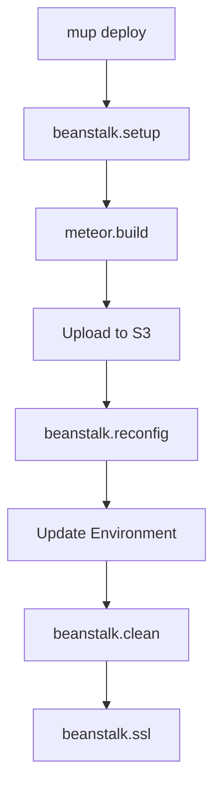

# Commands Reference

Complete reference for all `mup beanstalk` commands.

## Deployment Commands

### `mup deploy`

Deploy your application to Elastic Beanstalk.

```bash
mup deploy
mup deploy --cached-build  # Use previous build
```

**What it does:**
1. Runs `beanstalk.setup`
2. Builds Meteor application
3. Creates deployment bundle
4. Uploads to S3
5. Creates application version
6. Deploys to environment
7. Runs `beanstalk.ssl`

### `mup beanstalk setup`

Initialize AWS resources for deployment.

```bash
mup beanstalk setup
```

**Creates:**
- S3 bucket for bundles
- IAM roles and instance profiles
- Elastic Beanstalk application
- CloudWatch resources (if graceful shutdown enabled)

## Environment Management

### `mup beanstalk start`

Start a stopped environment.

```bash
mup beanstalk start
```

Sets minimum instances to configured value and waits for health checks.

### `mup beanstalk stop`

Stop the environment by scaling to 0 instances.

```bash
mup beanstalk stop
```

### `mup beanstalk restart`

Restart the application server.

```bash
mup beanstalk restart
```

### `mup beanstalk reconfig`

Update environment configuration without deploying.

```bash
mup beanstalk reconfig
```

Updates:
- Environment variables
- Instance count
- Meteor settings
- Scaling configuration

## Monitoring & Logs

### `mup beanstalk status`

View application and instance health.

```bash
mup beanstalk status
```

**Output includes:**
- Environment status
- Health status
- Request metrics
- Latency percentiles
- Instance health

### `mup beanstalk logs`

View application logs.

```bash
mup beanstalk logs
mup beanstalk logs --tail 100  # Last 100 lines
mup beanstalk logs --follow    # Follow log output
```

### `mup beanstalk logs-nginx`

View Nginx access and error logs.

```bash
mup beanstalk logs-nginx
```

### `mup beanstalk logs-eb`

View Elastic Beanstalk activity logs.

```bash
mup beanstalk logs-eb
```

Shows deployment and configuration logs.

### `mup beanstalk events`

View recent environment events.

```bash
mup beanstalk events
```

## SSL Management

### `mup beanstalk ssl`

Setup and check SSL certificate status.

```bash
mup beanstalk ssl
```

**What it does:**
1. Requests certificate from AWS ACM (if needed)
2. Shows validation status
3. Configures load balancer for HTTPS

## Debugging

### `mup beanstalk shell`

Open a Meteor shell on a production instance.

```bash
mup beanstalk shell              # Select instance interactively
mup beanstalk shell i-xxx        # Connect to specific instance
```

### `mup beanstalk debug`

Connect Node.js debugger to production instance.

```bash
mup beanstalk debug
mup beanstalk debug i-xxx
```

**Usage:**
1. Run the command
2. Open Chrome and navigate to `chrome://inspect`
3. Click "Open dedicated DevTools for Node"
4. Wait for connection

**Warning:** Do not use breakpoints in production - they pause the server.

## Maintenance

### `mup beanstalk clean`

Remove old application versions and bundles.

```bash
mup beanstalk clean
```

Keeps the number of versions specified in `oldVersions` config.

## Command Options

### Global Options

| Option | Description |
|--------|-------------|
| `--verbose` | Show detailed output |
| `--cached-build` | Use build from previous deploy |

### Example with Options

```bash
mup deploy --verbose --cached-build
```

## Command Flow



## Hooks

The plugin integrates with Meteor Up's hook system:

| Hook | Command |
|------|---------|
| `post.setup` | `beanstalk.setup` |
| `post.deploy` | `beanstalk.deploy` |
| `post.logs` | `beanstalk.logs` |
| `post.start` | `beanstalk.start` |
| `post.stop` | `beanstalk.stop` |
| `post.restart` | `beanstalk.restart` |
| `post.reconfig` | `beanstalk.reconfig` |
| `post.status` | `beanstalk.status` |

## Exit Codes

| Code | Meaning |
|------|---------|
| 0 | Success |
| 1 | Deployment failed |
| 2 | Configuration error |
| 3 | AWS API error |

## Environment Variables

### Required

- `AWS_ACCESS_KEY_ID` - AWS access key
- `AWS_SECRET_ACCESS_KEY` - AWS secret key

### Optional

- `AWS_REGION` - Default region (overridden by config)
- `METEOR_SETTINGS` - Meteor settings JSON

## Examples

### Deploy with verbose output

```bash
mup deploy --verbose
```

### Check status after deploy

```bash
mup deploy && mup beanstalk status
```

### View recent logs

```bash
mup beanstalk logs --tail 50
```

### Debug production issue

```bash
# Connect to instance
mup beanstalk shell

# Or connect debugger
mup beanstalk debug
```

### Stop environment for maintenance

```bash
mup beanstalk stop
# Perform maintenance...
mup beanstalk start
```
