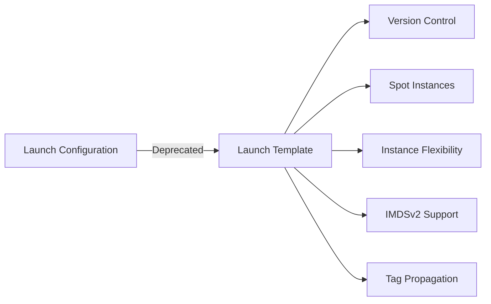

# Launch Templates Migration Guide

AWS is deprecating Launch Configurations in favor of Launch Templates. This guide explains how to migrate and take advantage of new features.

## Why Migrate?



### Benefits of Launch Templates

| Feature | Launch Configuration | Launch Template |
|---------|---------------------|-----------------|
| Version Control | ❌ | ✅ |
| Multiple Instance Types | ❌ | ✅ |
| Spot Instances | ❌ | ✅ |
| IMDSv2 Enforcement | ❌ | ✅ |
| Tag Propagation | ❌ | ✅ |
| Instance Market Options | ❌ | ✅ |

## Automatic Migration

Elastic Beanstalk automatically migrates to Launch Templates when you use certain options:

### Option 1: IMDSv2 Enforcement

```javascript
app: {
  disableIMDSv1: true  // Triggers Launch Template migration
}
```

### Option 2: Root Volume Configuration

```javascript
app: {
  rootVolume: {
    size: 20,
    type: 'gp3'
  }
}
```

### Option 3: Spot Instances

```javascript
app: {
  spotInstances: {
    enabled: true
  }
}
```

### Option 4: Multiple Instance Types

```javascript
app: {
  instanceTypes: ['t3.small', 't3a.small', 't2.small']
}
```

## Manual Migration

### Before (Launch Configuration)

```javascript
app: {
  instanceType: 't3.small',
  customBeanstalkConfig: [
    {
      namespace: 'aws:autoscaling:launchconfiguration',
      option: 'InstanceType',
      value: 't3.small'
    }
  ]
}
```

### After (Launch Template)

```javascript
app: {
  instanceTypes: ['t3.small', 't3a.small', 't2.small'],
  disableIMDSv1: true,  // Optional: enforce IMDSv2
  launchTemplateTagPropagation: true  // Optional: propagate tags
}
```

## IAM Permissions Update

If you use custom IAM policies, add these permissions:

```json
{
  "Version": "2012-10-17",
  "Statement": [
    {
      "Effect": "Allow",
      "Action": [
        "ec2:RunInstances",
        "ec2:CreateLaunchTemplate",
        "ec2:CreateLaunchTemplateVersions",
        "ec2:DeleteLaunchTemplate",
        "ec2:DeleteLaunchTemplateVersions",
        "ec2:DescribeLaunchTemplates",
        "ec2:DescribeLaunchTemplateVersions"
      ],
      "Resource": ["*"]
    }
  ]
}
```

> **Note**: These permissions are included in AWS managed policies for Elastic Beanstalk.

## Migration Steps

### Step 1: Update Configuration

Update your `mup.js` to use new options:

```javascript
module.exports = {
  app: {
    type: 'aws-beanstalk',
    name: 'my-app',
    path: '../',
    region: 'us-east-1',
    
    // Use instanceTypes instead of instanceType
    instanceTypes: ['t3.small', 't3a.small'],
    
    // Enable Launch Template features
    disableIMDSv1: true,
    
    // Your other config...
    minInstances: 1,
    maxInstances: 3,
    env: { /* ... */ },
    auth: { /* ... */ }
  },
  plugins: ['@activitree/mup-aws-beanstalk']
};
```

### Step 2: Deploy

```bash
mup deploy
```

Elastic Beanstalk will automatically create a Launch Template and migrate your environment.

### Step 3: Verify

Check that Launch Templates are being used:

```bash
aws ec2 describe-launch-templates --filters "Name=tag:elasticbeanstalk:environment-name,Values=your-env-name"
```

## Breaking Changes

### 1. IAM Permissions

**Impact**: Deployment fails with permission errors

**Solution**: Add Launch Template permissions to custom IAM policies

### 2. Instance Type Configuration

**Impact**: Old `aws:autoscaling:launchconfiguration:InstanceType` may be ignored

**Solution**: Use `instanceTypes` array in configuration

### 3. Tag Propagation

**Impact**: Tags may not propagate to new resources

**Solution**: Enable `launchTemplateTagPropagation: true`

## Rollback Plan

If issues arise after migration:

1. **Revert Configuration**:
   ```javascript
   app: {
     instanceType: 't3.small',  // Back to single type
     // Remove Launch Template options
   }
   ```

2. **Redeploy**:
   ```bash
   mup deploy
   ```

3. **Terminate Instances**:
   - Old instances will continue using Launch Configuration
   - New instances will use Launch Configuration

## Best Practices

### 1. Use Multiple Instance Types

```javascript
instanceTypes: ['t3.small', 't3a.small', 't2.small']
```

This provides:
- Instance type flexibility
- Better Spot Instance availability
- Cost optimization

### 2. Enable IMDSv2

```javascript
disableIMDSv1: true
```

IMDSv2 provides better security for instance metadata.

### 3. Configure Root Volume

```javascript
rootVolume: {
  size: 20,
  type: 'gp3'
}
```

GP3 volumes provide better performance at lower cost.

### 4. Enable Tag Propagation

```javascript
launchTemplateTagPropagation: true
```

Ensures tags are applied to all resources for cost allocation and access control.

## Troubleshooting

### Error: "Launch template permissions not found"

**Solution**: Add EC2 Launch Template permissions to your IAM policy.

### Error: "Instance type not available"

**Solution**: Use multiple instance types for flexibility:

```javascript
instanceTypes: ['t3.small', 't3a.small', 't2.small']
```

### Error: "IMDSv2 required"

**Solution**: Ensure your application supports IMDSv2, or disable:

```javascript
disableIMDSv1: false
```

## Additional Resources

- [AWS Launch Templates Documentation](https://docs.aws.amazon.com/AWSEC2/latest/UserGuide/ec2-launch-templates.html)
- [Elastic Beanstalk Launch Templates](https://docs.aws.amazon.com/elasticbeanstalk/latest/dg/environments-cfg-autoscaling-launch-templates.html)
- [IMDSv2 Migration](https://docs.aws.amazon.com/AWSEC2/latest/UserGuide/configuring-instance-metadata-service.html)
