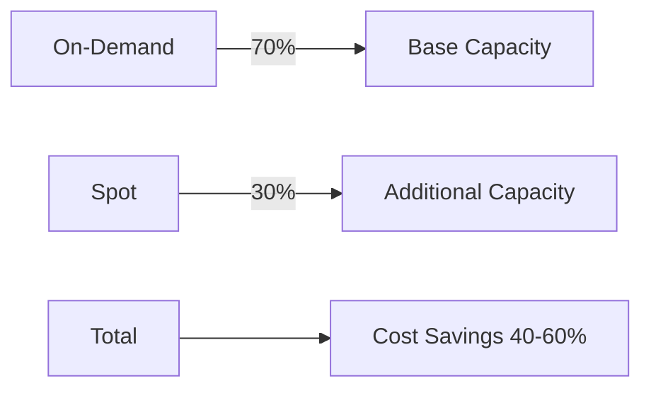

# Spot Instances Configuration

Save up to 90% on EC2 costs by using Spot Instances with your Elastic Beanstalk deployment.

## What are Spot Instances?

Spot Instances are spare EC2 capacity available at up to 90% discount compared to On-Demand prices. AWS can reclaim Spot Instances with a 2-minute warning when capacity is needed elsewhere.



## Basic Configuration

```javascript
module.exports = {
  app: {
    type: 'aws-beanstalk',
    name: 'my-app',
    path: '../',
    region: 'us-east-1',
    
    // Enable Spot Instances
    spotInstances: {
      enabled: true
    },
    
    // Instance types for Spot flexibility
    instanceTypes: ['t3.small', 't3a.small', 't2.small'],
    
    minInstances: 2,
    maxInstances: 10,
    
    env: { /* ... */ },
    auth: { /* ... */ }
  },
  plugins: ['@activitree/mup-aws-beanstalk']
};
```

## Advanced Configuration

```javascript
app: {
  spotInstances: {
    enabled: true,
    
    // Instance types for Spot (overrides instanceTypes)
    instanceTypes: ['t3.small', 't3a.small', 't2.small'],
    
    // Allocation strategy
    spotAllocationStrategy: 'capacity-optimized-prioritized',
    
    // Minimum On-Demand instances (always running)
    onDemandBase: 1,
    
    // Percentage of On-Demand above base
    onDemandAboveBasePercentage: 30
  }
}
```

## Configuration Options

### `enabled`

Enable or disable Spot Instances.

```javascript
spotInstances: {
  enabled: true  // Required
}
```

### `instanceTypes`

List of instance types for Spot. Multiple types increase availability.

```javascript
spotInstances: {
  enabled: true,
  instanceTypes: [
    't3.small',    // Primary choice
    't3a.small',   // AMD equivalent
    't2.small'     // Older generation fallback
  ]
}
```

### `spotAllocationStrategy`

How Spot capacity is allocated:

| Strategy | Description | Best For |
|----------|-------------|----------|
| `capacity-optimized-prioritized` | Prioritizes instance types by order | Most workloads |
| `capacity-optimized` | Chooses pools with most capacity | High availability |
| `price-capacity-optimized` | Balances price and capacity | Cost optimization |
| `lowest-price` | Chooses lowest price pools | Maximum savings |

```javascript
spotInstances: {
  enabled: true,
  spotAllocationStrategy: 'capacity-optimized-prioritized'
}
```

### `onDemandBase`

Minimum number of On-Demand instances that always run.

```javascript
spotInstances: {
  enabled: true,
  onDemandBase: 1  // At least 1 On-Demand instance
}
```

### `onDemandAboveBasePercentage`

Percentage of additional capacity that is On-Demand.

```javascript
spotInstances: {
  enabled: true,
  onDemandBase: 1,
  onDemandAboveBasePercentage: 30  // 30% On-Demand, 70% Spot
}
```

## Example Scenarios

### Maximum Savings

All Spot Instances for maximum cost savings:

```javascript
spotInstances: {
  enabled: true,
  instanceTypes: ['t3.small', 't3a.small', 't2.small'],
  spotAllocationStrategy: 'lowest-price',
  onDemandBase: 0,
  onDemandAboveBasePercentage: 0
}
```

### Balanced Approach

Mix of On-Demand and Spot for reliability:

```javascript
spotInstances: {
  enabled: true,
  instanceTypes: ['t3.small', 't3a.small'],
  spotAllocationStrategy: 'capacity-optimized-prioritized',
  onDemandBase: 1,
  onDemandAboveBasePercentage: 30
}
```

### High Availability

More On-Demand instances for critical workloads:

```javascript
spotInstances: {
  enabled: true,
  instanceTypes: ['t3.medium', 't3a.medium'],
  spotAllocationStrategy: 'capacity-optimized',
  onDemandBase: 2,
  onDemandAboveBasePercentage: 50
}
```

## Best Practices

### 1. Use Multiple Instance Types

```javascript
// Good - Multiple options for Spot
instanceTypes: ['t3.small', 't3a.small', 't2.small']

// Bad - Single instance type limits Spot availability
instanceTypes: ['t3.small']
```

### 2. Maintain On-Demand Base

Always have at least one On-Demand instance:

```javascript
onDemandBase: 1  // Ensures minimum capacity
```

### 3. Use Capacity Optimized Strategy

```javascript
spotAllocationStrategy: 'capacity-optimized-prioritized'
```

This strategy:
- Reduces Spot interruptions
- Maintains application availability
- Still provides significant cost savings

### 4. Configure Graceful Shutdown

Handle Spot interruptions gracefully:

```javascript
app: {
  gracefulShutdown: true,
  spotInstances: {
    enabled: true
  }
}
```

### 5. Monitor Spot Interruptions

AWS provides a 2-minute warning before Spot termination. Your application should:
- Handle SIGTERM signal
- Complete in-flight requests
- Disconnect from services gracefully

## Cost Comparison

| Configuration | On-Demand Cost | Spot Cost | Savings |
|--------------|----------------|-----------|---------|
| 100% On-Demand | $100 | - | 0% |
| 50% On-Demand, 50% Spot | $100 | $50 | 50% |
| 30% On-Demand, 70% Spot | $100 | $30 | 70% |
| 100% Spot | $100 | $10 | 90% |

*Example based on t3.small instances in us-east-1*

## Handling Spot Interruptions

### Application Level

```javascript
// In your Meteor application
process.on('SIGTERM', () => {
  console.log('Received SIGTERM - shutting down gracefully');
  
  // Close connections
  // Complete in-flight requests
  // Disconnect from MongoDB
  
  process.exit(0);
});
```

### Infrastructure Level

Enable graceful shutdown in configuration:

```javascript
app: {
  gracefulShutdown: true,
  env: {
    METEOR_SIGTERM_GRACE_PERIOD_SECONDS: 30
  }
}
```

## Monitoring

### CloudWatch Metrics

Monitor Spot metrics:
- `SpotInstanceInterruptions`
- `SpotInstanceRequests`
- `GroupDesiredCapacity`
- `GroupInServiceInstances`

### Spot Instance Advisor

Check Spot pricing and interruption rates:
- [Spot Instance Advisor](https://aws.amazon.com/ec2/spot/instance-advisor/)

## Limitations

1. **Not for Time-Critical Workloads**: Spot can be interrupted
2. **Instance Availability**: Some instance types may not be available
3. **Region Dependent**: Spot capacity varies by region

## Troubleshooting

### "No Spot capacity available"

**Solution**: Add more instance types:

```javascript
instanceTypes: ['t3.small', 't3a.small', 't2.small', 't2.micro']
```

### "Spot instances being terminated frequently"

**Solution**: Use capacity-optimized strategy:

```javascript
spotAllocationStrategy: 'capacity-optimized'
```

### "Application errors during Spot termination"

**Solution**: Implement graceful shutdown:

```javascript
app: {
  gracefulShutdown: true,
  env: {
    METEOR_SIGTERM_GRACE_PERIOD_SECONDS: 30
  }
}
```

## Additional Resources

- [AWS Spot Instances](https://aws.amazon.com/ec2/spot/)
- [Spot Best Practices](https://docs.aws.amazon.com/AWSEC2/latest/UserGuide/spot-best-practices.html)
- [Spot Pricing](https://aws.amazon.com/ec2/spot/pricing/)
